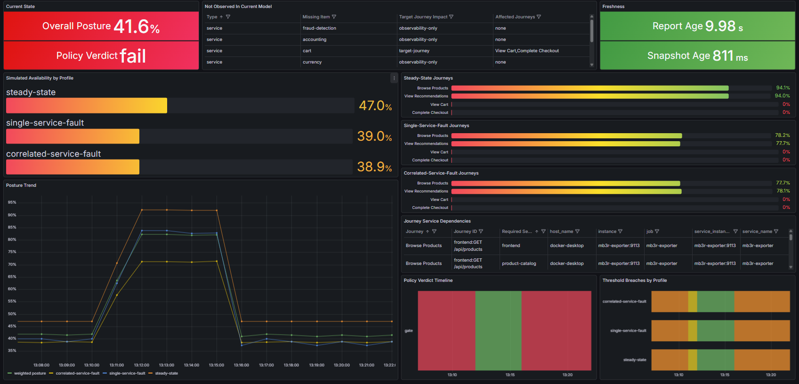

# MB3R Overlay For OpenTelemetry Demo

This overlay keeps the upstream Astronomy Shop demo intact and adds an MB3R path on top of it:

- the existing OpenTelemetry Collector fans out traces to Bering
- Bering emits rolling discovery snapshots under [`mb3r/out/artifacts`](./out/artifacts)
- the snapshot sanitizer writes a Sheaft-safe copy to `latest-snapshot-sanitized.json`
- Sheaft watches the sanitized snapshot and writes report history under [`mb3r/out/history`](./out/history)
- the MB3R exporter mirrors the current Sheaft report under [`mb3r/out/reports`](./out/reports) and exposes Prometheus metrics for Grafana
- Grafana gets an additive MB3R dashboard at the existing `/grafana/` route
- the MB3R probe keeps the four target storefront journeys warm so they stay visible in the trace-derived model

This is a resilience posture overlay, not a replacement for the demo's existing observability dashboards.

## Start

From the repository root:

```powershell
docker compose --env-file .env --env-file .env.override `
  -f docker-compose.yml `
  -f mb3r/docker-compose.mb3r.yml `
  up -d
```

Primary entry points:

- Demo UI: `http://localhost:8080`
- Grafana: `http://localhost:8080/grafana/`
- MB3R dashboard: `http://localhost:8080/grafana/d/mb3r-resilience/mb3r-resilience-posture`

Additional host ports:

- Bering: `http://localhost:14318`
- Sheaft: `http://localhost:19080`
- MB3R exporter: `http://localhost:19113`

## Stop

```powershell
docker compose --env-file .env --env-file .env.override `
  -f docker-compose.yml `
  -f mb3r/docker-compose.mb3r.yml `
  down --remove-orphans
```

## Core Files And Endpoints

Host-visible artifacts:

- Latest raw Bering snapshot: [`mb3r/out/artifacts/latest-snapshot.json`](./out/artifacts/latest-snapshot.json)
- Latest sanitized snapshot: [`mb3r/out/artifacts/latest-snapshot-sanitized.json`](./out/artifacts/latest-snapshot-sanitized.json)
- Rolling Bering snapshots: [`mb3r/out/artifacts/snapshots`](./out/artifacts/snapshots)
- Current mirrored Sheaft status: [`mb3r/out/reports/status.json`](./out/reports/status.json)
- Current mirrored Sheaft report: [`mb3r/out/reports/current-report.json`](./out/reports/current-report.json)
- Exporter snapshot context: [`mb3r/out/reports/snapshot-context.json`](./out/reports/snapshot-context.json)
- Sheaft report history: [`mb3r/out/history`](./out/history)
- Healthy baseline captured by the fault demo: [`mb3r/out/baseline/healthy-report.json`](./out/baseline/healthy-report.json)

Runtime endpoints:

- Bering health: `http://localhost:14318/healthz`
- Bering metrics: `http://localhost:14318/metrics`
- Sheaft status: `http://localhost:19080/status`
- Sheaft current report: `http://localhost:19080/current-report`
- MB3R exporter metrics: `http://localhost:19113/metrics`
- Prometheus query API: `http://localhost:9090/api/v1/query`

## Overlay Semantics

The current milestone models four target frontend journeys:

- `Browse Products` -> `frontend:GET /api/products`
- `View Recommendations` -> `frontend:GET /api/recommendations`
- `View Cart` -> `frontend:GET /api/cart`
- `Complete Checkout` -> `frontend:POST /api/checkout`

The predicate contract is defined in [`mb3r/config/sheaft/predicate-contract.yaml`](./config/sheaft/predicate-contract.yaml):

- `GET /api/products` requires `frontend` and `product-catalog`
- `GET /api/recommendations` requires `frontend` and `recommendation`
- `GET /api/cart` requires `frontend` and `cart`
- `POST /api/checkout` requires `frontend`, `checkout`, `cart`, `payment`, and `shipping`

The current journey weights are equal at `0.25` each in [`mb3r/config/exporter/expected-endpoints.json`](./config/exporter/expected-endpoints.json). That means the current `Overall Posture` is effectively an average across the four target journeys, not traffic-weighted business importance.

## Dashboard: What Each Block Means

The MB3R dashboard is a predicted resilience posture view built from Bering-discovered topology and Sheaft analysis. It should be read as a model-and-policy screen, not as a raw container health screen.

Example dashboard view:



### Current State

Contains:

- `Overall Posture`
- `Policy Verdict`

`Overall Posture`

- exporter-derived score from `0` to `1`
- computed from the three modeled profile aggregates
- higher is better
- in the current config, it is the mean of:
  - `steady-state`
  - `single-service-fault`
  - `correlated-service-fault`

`Policy Verdict`

- exporter-derived verdict: `pass`, `warn`, `fail`, `error`
- driven by the four target journeys and thresholds in [`mb3r/config/exporter/policy.json`](./config/exporter/policy.json)
- this is the headline operational verdict for the dashboard

Important:

- this is not the raw Sheaft `decision`
- raw Sheaft can still say `pass` when target journeys fall out of the current model
- the dashboard deliberately uses the exporter-modeled verdict because it zero-fills missing target journeys

### Not Observed In Current Model

Shows services and target journeys that are missing from the current Bering snapshot.

Interpretation:

- this is trace-derived model presence
- this is not the same thing as Docker or Kubernetes health
- a service can be running and still appear here if it is not being observed in the current discovery window

Columns:

- `Type`
  `service` or `journey`
- `Missing Item`
  human-readable service or journey name
- `Target Journey Impact`
  `target-journey` means this missing item affects one of the four target journeys
  `observability-only` means it is monitored inventory, but not part of the current target posture contract
- `Affected Journeys`
  the journeys impacted by that missing service

### Freshness

Contains:

- `Report Age`
- `Snapshot Age`

`Report Age`

- age of the latest Sheaft report currently used by the exporter
- green is fresh, yellow is aging, red is stale

`Snapshot Age`

- age of the latest Bering snapshot metric
- should usually stay much lower than `Report Age`

If `Snapshot Age` stays fresh but `Report Age` grows, Bering is still discovering topology while the Sheaft/exporter side is lagging.

### Simulated Availability By Profile

Shows the modeled aggregate availability for three profiles:

- `steady-state`
- `single-service-fault`
- `correlated-service-fault`

Interpretation:

- `steady-state` is the baseline profile and should be the easiest one to read during a live runtime incident
- the two fault profiles are counterfactual projections, not additional live measurements
- they answer "how resilient is the current topology if we add more failure pressure"

### Steady-State Journeys / Single-Service-Fault Journeys / Correlated-Service-Fault Journeys

These three panels show the same four target journeys, separated by profile so the baseline does not get visually mixed with the fault projections.

The journey bars are:

- `Browse Products`
- `View Recommendations`
- `View Cart`
- `Complete Checkout`

Interpretation:

- higher is better
- `0` means the journey is currently missing or broken in the active trace-derived model
- clicking a journey bar filters the dependency table below

### Journey Service Dependencies

Drilldown table for the selected journey.

It shows:

- `Journey`
- `Journey ID`
- `Required Service`

Use it to answer "why did this journey go red" or "why did stopping one service affect another journey".

### Posture Trend

Time series of:

- overall posture
- profile aggregates

Interpretation:

- this is model-derived trend, not direct uptime
- it can reflect real topology changes
- it can also reflect trace-window churn and workload cadence

Do not read small movements here as incident evidence without checking coverage, freshness, and missing-model context.

### Policy Verdict Timeline

Timeline of the exporter-derived verdict state over time.

Use it to answer:

- when the system crossed from acceptable to unacceptable
- whether the current failure is transient or sustained

### Threshold Breaches By Profile

Shows how many of the four target journeys are below threshold for each profile.

Interpretation:

- `0` means no target journey is currently below policy threshold
- `2` means two of the four target journeys are below threshold in that profile

## How To Read A `cart down` Incident

When `cart` is stopped and the discovery window has rolled forward, the expected posture is:

- `View Cart` drops to `0`
- `Complete Checkout` often drops to `0` as well, because checkout depends on cart in the semantic contract
- `Policy Verdict` becomes `fail`
- `Overall Posture` drops substantially
- `Not Observed In Current Model` includes `cart`
- it may also include `checkout`, `payment`, or `shipping` if those services fall out of the observed trace model

Important nuance:

- the dashboard is not trying to say "payment container is down"
- it is saying "payment is not present in the current trace-derived model"

## Raw Health Vs MB3R

Use these tools for raw health:

- `docker compose ... ps`
- the demo's normal Grafana dashboards
- Jaeger traces
- service logs

Use MB3R when you want:

- journey-level impact
- blast radius in terms of storefront operations
- a policy verdict
- modeled resilience posture under fault profiles

## Smoke Check

Run:

```powershell
powershell -ExecutionPolicy Bypass -File mb3r/scripts/smoke.ps1
```

The smoke flow:

- generates deterministic traffic for the four target journeys
- waits for Bering readiness
- waits for a host-visible latest snapshot
- waits for Sheaft readiness and a current report
- confirms Prometheus can query a healthy-enough MB3R posture score
- confirms the Grafana MB3R dashboard is provisioned

## Controlled Failure Demo

Default fault demo:

```powershell
powershell -ExecutionPolicy Bypass -File mb3r/scripts/fault-demo.ps1
```

Restore path:

```powershell
powershell -ExecutionPolicy Bypass -File mb3r/scripts/fault-demo.ps1 -Action restore
```

The default demo stops `recommendation`, resets the Bering discovery window, and keeps the remaining storefront traffic hot so the failed journey visibly falls out of the current model.

## Troubleshooting

### The dashboard looks stale

Check:

- `http://localhost:19080/status`
- `http://localhost:19113/metrics`
- `mb3r_report_age_seconds`
- `mb3r_last_success_timestamp_seconds`

Healthy pattern:

- `mb3r_last_success_timestamp_seconds` moves every few seconds
- `mb3r_report_age_seconds` stays low

If `last_success` stops moving while the exporter process is still up, the exporter poll loop is lagging or stuck.

### `Not Observed In Current Model` shows a service that is still running

That is possible and expected.

This panel means:

- the service is missing from the current trace-derived model

It does not mean:

- the container is definitely down

Use `docker compose ps` for raw container state.

### `cart` is down but the dashboard barely changes

Check:

- `mb3r_endpoint_availability{profile="steady-state",journey="View Cart"}`
- `mb3r_endpoint_availability{profile="steady-state",journey="Complete Checkout"}`
- `mb3r_expected_journey_coverage_ratio`
- `docker logs mb3r-probe`

If the probe is already failing and the cart/checkout journeys were already absent from the trace model before you stopped `cart`, the posture may already be sitting on the degraded plateau.

### `cart` is healthy but cart and checkout are missing from the dashboard

Check the synthetic probe:

```powershell
docker logs --since 15m mb3r-probe
```

The probe keeps the target journeys present in the discovery window.
If it cannot complete `POST /api/cart` or `POST /api/checkout`, the current model can lose those journeys even while the underlying service is up.

### Sheaft says `pass` but the dashboard says `fail`

That is currently possible in this overlay.

Reason:

- raw Sheaft report evaluation only considers the endpoints present in the current report
- the exporter zero-fills missing target journeys and then re-evaluates policy for the dashboard

For dashboard interpretation, trust the exporter verdict.

## Known Limitations

- This is demo-oriented overlay behavior, not a production-hardened control plane.
- The semantic contract is specific to the current OpenTelemetry Demo milestone.
- The current dashboard is journey-aware, but still trace-window-derived.
- `Not Observed In Current Model` is not a direct health panel.
- `Posture Trend` can reflect both real topology change and trace-window/workload churn.
- The current semantic layer is explicit and hand-authored, not fully inferred.
- The exporter now compares the current snapshot with the previously seen snapshot in memory for responsiveness; long snapshot history remains archival only.

## Next Step After Reading This File

If you need to work with the overlay day to day:

1. Start with the dashboard and the three freshness/current-state panels.
2. Confirm the current model with `Not Observed In Current Model`.
3. Click the affected journey to inspect required services.
4. Compare against raw health using `docker compose ps`, logs, and the standard observability dashboards.
5. Use Bering and Sheaft raw endpoints only when you need to distinguish discovery, semantics, and exporter interpretation.
